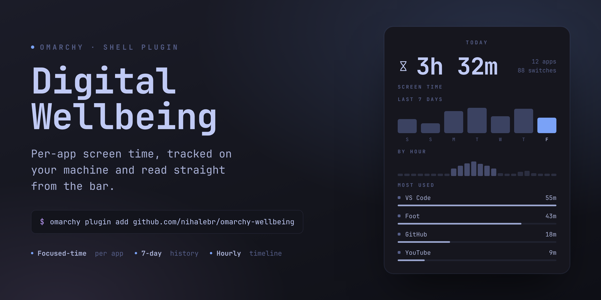
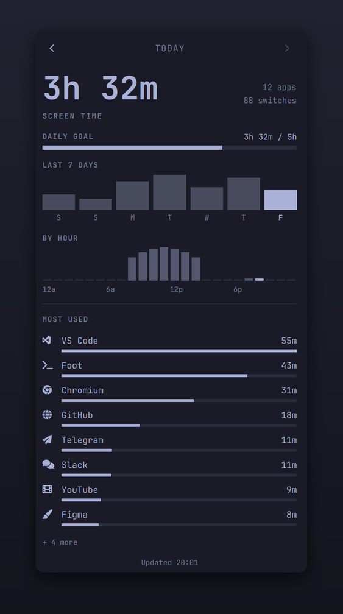

# Digital Wellbeing for Omarchy



A screen-time tracker for the Omarchy shell, in the spirit of Android's Digital
Wellbeing. It watches which application is focused, adds up the time per app for
each day, and shows the breakdown in a bar popup: today's total, a seven-day
strip, an hourly timeline, and a most-used list.

Everything stays on your machine — one plain JSON file per day under
`~/.local/state/omarchy/wellbeing/`. Nothing is sent anywhere.

## Screenshots

<table>
<tr>
<td width="44%" valign="top">

</td>
<td valign="top">

**The breakdown popup.** Today's total with an optional daily goal, a
seven-day strip, an hour-by-hour timeline, and the most-used apps each with
a usage meter. Browser web apps resolve to their real names (YouTube, GitHub,
Slack…) instead of a synthetic `app_id`.

<br>


**In the bar.** An hourglass, optionally with today's running total beside it.
Left-click opens the popup; it can also be summoned from a keybinding.

<sub>Screenshots use sample data.</sub>

</td>
</tr>
</table>

## What it does

- **Tracks the focused window.** Every few seconds (and on every focus change)
  it credits the elapsed time to the focused app's total for the current day.
- **Ignores idle time.** Counting pauses after a configurable stretch with no
  keyboard or mouse input (default 3 minutes), and the screensaver / lock
  surfaces are never counted.
- **Bar icon.** An hourglass in the bar. Left-click opens the breakdown;
  optionally it also shows the running total next to the icon.
- **Popup.** Day total, `‹ / ›` to step through past days (arrow keys too),
  a 7-day bar strip (click a day to jump to it), an hour-by-hour timeline,
  and the most-used apps with time and a usage meter.

## Requirements

A stock Omarchy install (shell v4 / Quattro or newer) is all the plugin itself
needs. The optional `bin/omarchy-wellbeing` terminal reporter also calls `jq`,
which Omarchy already ships. No other external dependencies, and nothing is
downloaded or built at install or run time.

## Install

```bash
omarchy plugin add https://github.com/nihalebr/omarchy-wellbeing.git --enable
```

That clones the plugin to `~/.config/omarchy/plugins/nihalebr.wellbeing/`, drops
the hourglass into the right of the bar, and starts the tracker. Add `--yes` to
skip the prompts. Pull later updates with:

```bash
omarchy plugin update nihalebr.wellbeing
```

Move it like any widget, or turn it off:

```bash
omarchy bar move   nihalebr.wellbeing --section right --before omarchy.tray
omarchy plugin disable nihalebr.wellbeing
omarchy plugin remove  nihalebr.wellbeing
```

### Hacking on it

To work on the plugin, symlink a checkout in instead of using `plugin add`:

```bash
git clone https://github.com/nihalebr/omarchy-wellbeing.git ~/src/omarchy-wellbeing
ln -s ~/src/omarchy-wellbeing ~/.config/omarchy/plugins/nihalebr.wellbeing
omarchy restart shell
omarchy plugin enable nihalebr.wellbeing --section right
```

> **After editing the plugin's `.qml`,** an `omarchy restart shell` is the
> reliable way to pick the change up — the in-place hot reload sometimes keeps
> a cached copy of a widget component.

## Settings

Set these inline on the widget's entry in `~/.config/omarchy/shell.json`
(`bar.layout.right` → the `{ "id": "nihalebr.wellbeing", ... }` object). The
file hot-reloads on save.

| Key | Default | Meaning |
|-----|---------|---------|
| `showLabel` | `"Off"` | `"On"` shows today's running total beside the bar icon |
| `dailyGoalMinutes` | `0` | A daily limit. The popup shows progress toward it and the bar icon turns urgent once you pass it. `0` disables it. |
| `idleTimeoutSeconds` | `180` | Seconds with no input before tracking pauses |
| `sampleSeconds` | `5` | How often the focused window is polled |
| `historyDays` | `14` | Day files older than this are pruned on shell start |

Example:

```json
{ "id": "nihalebr.wellbeing", "showLabel": "On", "dailyGoalMinutes": 240 }
```

## Keybinding

The popup can be summoned over IPC, so you can bind it. In
`~/.config/hypr/bindings.lua` (`SUPER + CTRL + U` is free and matches the other
`SUPER + CTRL + <letter>` panel toggles):

```lua
o.bind("SUPER + CTRL + U", "Screen time", "omarchy-shell nihalebr.wellbeing.ui toggle")
```

## Command line

`bin/omarchy-wellbeing` formats the same data for the terminal. Symlink it onto
your `PATH` if you want it:

```bash
ln -s ~/.config/omarchy/plugins/nihalebr.wellbeing/bin/omarchy-wellbeing ~/.local/bin/omarchy-wellbeing

omarchy-wellbeing                 # today
omarchy-wellbeing yesterday --bars
omarchy-wellbeing 2026-08-20
omarchy-wellbeing --week          # last 7 days, one line each
omarchy-wellbeing --list
omarchy-wellbeing today --json
```

The shell service also answers a couple of IPC calls directly:

```bash
omarchy-shell nihalebr.wellbeing status      # JSON: today's total, top app, tracking state
omarchy-shell nihalebr.wellbeing flush       # force a write to disk now
omarchy-shell nihalebr.wellbeing reset today  # wipe a day (today | yesterday | YYYY-MM-DD)
```

## Data & privacy

- One file per local day: `~/.local/state/omarchy/wellbeing/YYYY-MM-DD.json`
- Each holds per-app seconds, a focus-switch count, and 24 hourly buckets. App
  window titles are not stored beyond the last title seen per app (used only as
  a hint), and nothing leaves the machine.
- The service owns its state directory (`$XDG_STATE_HOME/omarchy/wellbeing`,
  default `~/.local/state/omarchy/wellbeing/`). It creates the directory `0700`
  and will not read, write, or delete through it if it is a symlink or is not
  owned by you; day files are written `0600` via an unpredictable temp name and
  an atomic rename, and no record is ever passed on a command line. If the
  directory is a symlink the service logs why
  (`journalctl --user | grep omarchy-shell`) and keeps running without
  persisting — replace it with a real directory to recover. `XDG_STATE_HOME`
  (which relocates *all* of your XDG state, not just this) is honoured, when
  absolute, by the service, the bar widget, and the `omarchy-wellbeing` reporter.
- Delete a day by removing its file, or all of it by removing the folder.

## How time is counted

`app_id` from the Wayland foreground toplevel is the key. A single credit is
capped at a few sample intervals, so a suspend/resume or a long idle stretch
can never dump a big block onto whatever happened to be focused. Time is split
at midnight into the correct day's file.

It is wall-clock time the app was **focused and you were active** — not CPU
time, and not background activity. A terminal running a long build in the
background while you read in a browser counts as browser time.

**Web apps** (`omarchy-webapp-install`, or a browser's "install this site")
report an `app_id` like `chrome-youtube.com__-Default`. The service reads the
name back from the app's `.desktop` launcher when there is one — so it shows
"YouTube", "Google Maps" — and otherwise falls back to a known-site name or the
bare host. Newly installed web apps are picked up within a few minutes, or
immediately on the next `omarchy restart shell`.

## Development

```
manifest.json          plugin manifest (kinds: service + bar-widget)
Service.qml             headless tracker — the only writer of the day files
BarWidget.qml           bar icon + KeyboardPanel breakdown popup (reader only)
Model.js                pure helpers: day-record shape, name/icon maps, formatting
bin/omarchy-wellbeing   terminal report
```

```bash
omarchy plugin validate .                 # checks the manifest against the shell's schema
/usr/lib/qt6/bin/qmlformat -i *.qml        # reindent + syntax-check
omarchy restart shell                      # load changes (see the note above)
journalctl --user -f | grep omarchy-shell  # console.log / QML warnings
```

## Uninstall

```bash
omarchy plugin disable nihalebr.wellbeing
rm -rf ~/.config/omarchy/plugins/nihalebr.wellbeing
rm -rf ~/.local/state/omarchy/wellbeing        # optional: the collected data
```

Or, for a git-managed install: `omarchy plugin remove nihalebr.wellbeing`.

## License

MIT — see [LICENSE](LICENSE).
